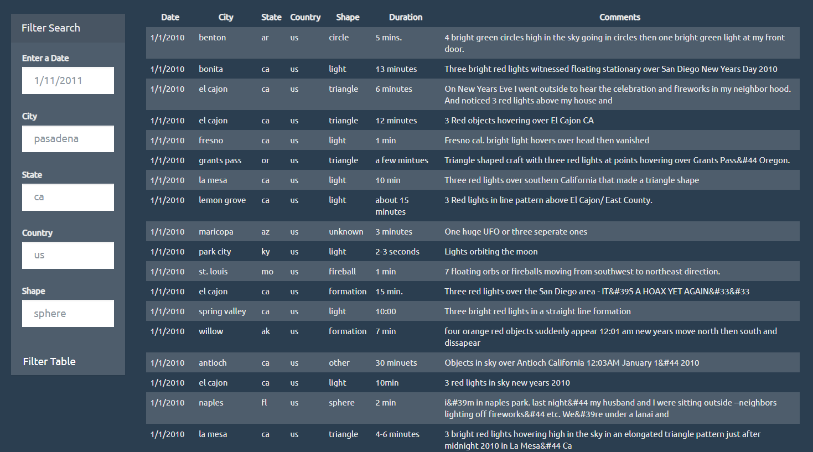

# JavaScript and DOM Manipulation

## Background

The objective of this project is to create HTML webpage that contains a table dynamically based upon a dataset of UFO sightings.

This webpage will allow users to search through the table for specific pieces of information. To achieve the goal of this project, a UFO dataset was provided in a form of a JavaScript object and the task was to write a Javascript code that would append a table to the webpage and then add new rows of data for each UFO sighting.

In addition, JavaScript was used to create multiple search categories so the user can set multiple filters and search for particular UFO sightings using the criteria based on the table columns.

Finally, CSS and Bootstrap were used to create the styling of webpage.

